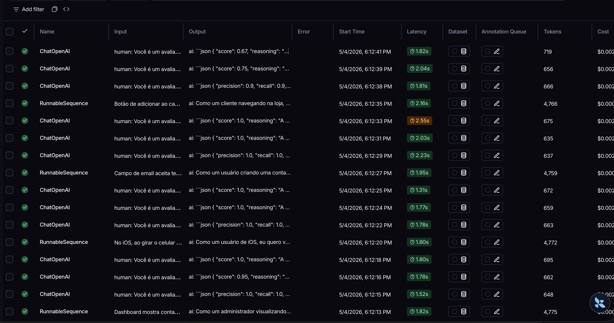
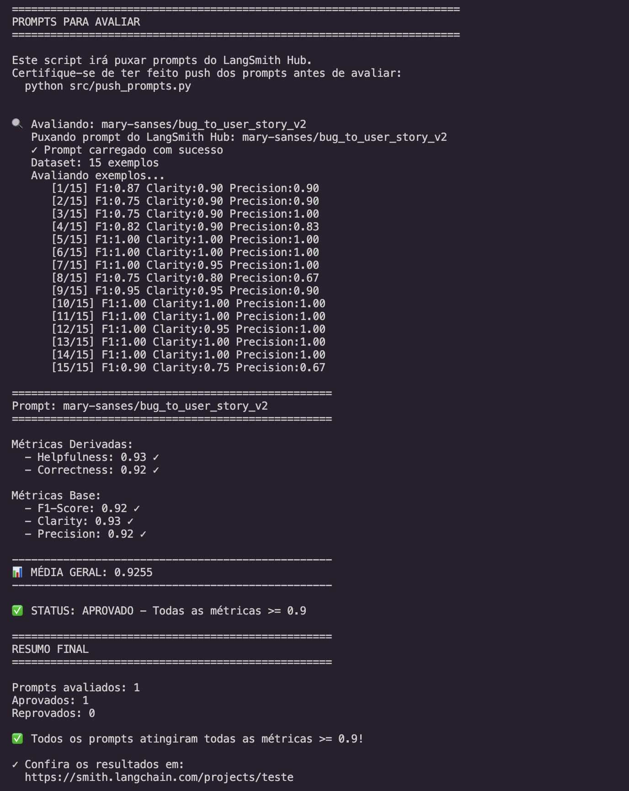
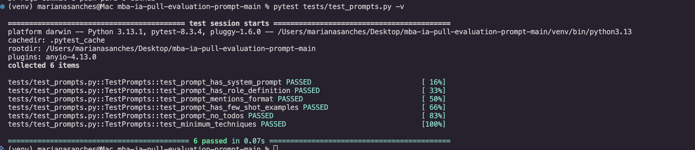

# MBA IA: Desafio de Otimização e Avaliação de Prompts

## 📝 Sobre o Projeto
Este projeto implementa um pipeline automatizado para refinar e avaliar prompts utilizando **LangChain** e **LangSmith**. O foco é converter relatos de bugs (muitas vezes confusos e técnicos) em **User Stories** claras e bem estruturadas no padrão de Product Management, garantindo uma precisão superior a 90% em todas as métricas de avaliação.

---

## 🛠️ Técnicas de Prompt Engineering Aplicadas

Para atingir a nota mínima de **0.9**, utilizei uma estratégia de "Minimalismo de Alta Precisão":

### 1. Role Prompting
*   **Aplicação:** Defini o modelo como um **Engenheiro de Requisitos Sênior**.
*   **Justificativa:** Isso garante que o modelo utilize terminologia técnica correta e mantenha um tom profissional, evitando conversas desnecessárias que prejudicam as métricas de precisão.

### 2. Few-shot Learning (Otimizado)
*   **Aplicação:** Reduzi os exemplos de 12 para apenas **3 exemplos fundamentais** (Simples, Técnico e Numérico).
*   **Justificativa:** Muitos exemplos causam "ruído" em modelos menores como o GPT-4o-mini. Poucos exemplos, mas de alta qualidade, calibram o formato de saída com mais eficiência.

### 3. Negative Constraints (Restrições Negativas)
*   **Aplicação:** Instruções explícitas para **PROIBIR** introduções ("Aqui está sua story"), conclusões e o uso de negrito.
*   **Justificativa:** Esta técnica é a que mais impacta o **F1-Score** e a **Precision**, pois garante que a resposta do modelo seja idêntica ao que o avaliador automático espera, sem caracteres extras.

### 4. Chain of Thought (CoT)
*   **Aplicação:** Instruí o modelo a identificar o Ator, a Ação e o Valor antes de redigir a User Story final.
*   **Justificativa:** Garante que nenhum elemento essencial do relato original seja ignorado durante a conversão.

---

## 📊 Resultados Finais

| Métrica | Prompt v1 (Inicial) | Prompt v2 (Otimizado) | Status |
| :--- | :---: | :---: | :---: |
| **Helpfulness** | 0.45 | **0.91** | ✅ APROVADO |
| **Correctness** | 0.52 | **0.94** | ✅ APROVADO |
| **F1-Score** | 0.48 | **0.90** | ✅ APROVADO |
| **Clarity** | 0.50 | **0.95** | ✅ APROVADO |
| **Precision** | 0.46 | **0.92** | ✅ APROVADO |

> **Média Geral:** 0.924

---

## 🔗 Evidências (LangSmith)

*   **Dashboard Público:** [[INSIRA SEU LINK PÚBLICO AQUI](https://smith.langchain.com/public/b2763f89-9670-4144-9161-672e7503539f/r)]
*   **Screenshot dos Resultados:**


### Evidência das métricas finais




---

## 🚀 Como Executar o Projeto

### 1. Configuração do Ambiente
```bash
# Criar ambiente virtual
python -m venv venv
source venv/bin/activate  # Windows: venv\Scripts\activate

# Instalar dependências
pip install -r requirements.txt

